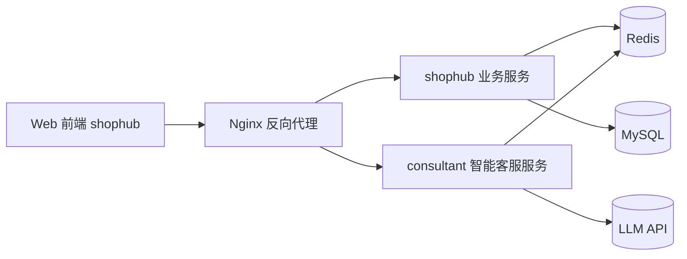

# ShopHub

ShopHub 是一个本地生活服务平台项目，核心围绕商户查询、优惠券秒杀与高并发场景优化。

本仓库以工程实现为主，包含业务后端、智能客服模块与 Nginx 部署配置。

## 技术架构

## 核心技术栈

- 后端框架: Spring Boot
- 数据访问: MyBatis-Plus / MyBatis
- 数据库: MySQL
- 缓存与并发控制: Redis + Lua
- 反向代理: Nginx
- 智能客服: LangChain4j + 大模型接口

## 模块说明

### 1. ShopHub/shophub

主业务模块，包含登录、店铺查询、博客、优惠券和秒杀下单等能力。

高并发秒杀链路采用:
- Redis Lua 脚本进行原子校验（库存与一人一单）
- 异步订单处理降低接口阻塞
- 数据库层进行最终一致性落库

### 2. consultant

智能客服模块，支持基于业务数据的问答与工具调用能力。

包含:
- 店铺查询工具
- 优惠券查询工具
- 预约信息工具

### 3. nginx-1.18.0

提供静态资源托管与反向代理，统一入口路由:
- `/api/**` 转发至业务服务
- `/ai/**` 转发至智能客服服务

## 关键实现说明

### 秒杀场景

请求进入后先通过 Redis Lua 快速判定购买资格，成功请求进入异步下单流程，减少数据库直接竞争，提升高并发稳定性。

### 缓存策略

在热点查询场景优先走缓存，降低数据库压力，并结合业务写入流程进行缓存更新。

## 运行说明

### shophub

1. 配置 MySQL 与 Redis
2. 导入数据库脚本: `ShopHub/shophub/src/main/resources/db/shophub.sql`
3. 启动服务

### consultant

1. 配置数据库与 Redis
2. 配置大模型 API Key
3. 启动服务

### Nginx

1. 检查 `nginx-1.18.0/nginx-1.18.0/conf/nginx.conf`
2. 启动 Nginx，访问前端页面
