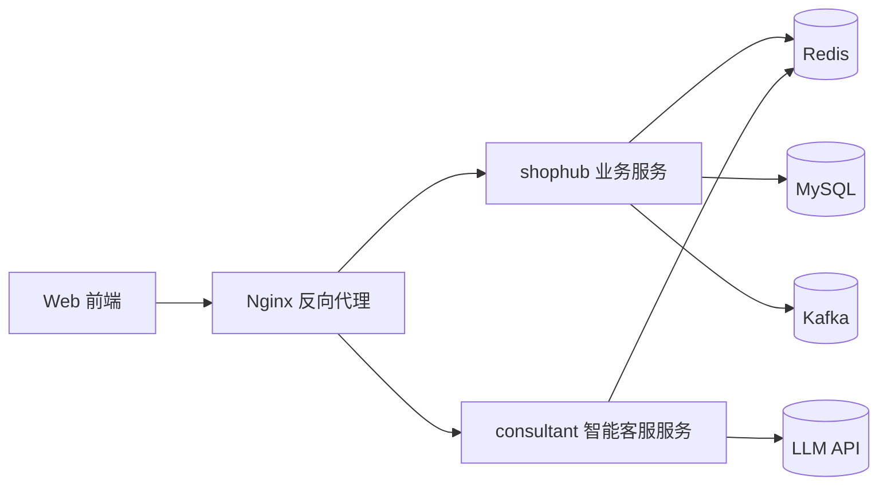

# ShopHub

ShopHub 是一个本地生活服务平台项目，核心围绕商户查询、优惠券秒杀与高并发场景优化展开。

本项目是在原有业务项目基础上，结合自己的理解持续进行重构、补强与扩展的工程化实践版本。重点不只是完成基础功能，还进一步围绕缓存一致性、秒杀异步化、订单状态流转与智能问答接入等方向做了持续学习与实现。

本仓库以工程实现为主，包含业务后端、智能客服模块与 Nginx 部署配置。

## 技术架构

## 核心技术栈

- 后端框架：Spring Boot
- 数据访问：MyBatis-Plus / MyBatis
- 数据库：MySQL
- 缓存与并发控制：Redis、Lua、Caffeine
- 消息队列：Kafka
- 反向代理：Nginx
- 智能客服：LangChain4j + 百炼兼容接口

## 模块说明

### 1. `ShopHub/shophub`

主业务模块，包含登录、店铺查询、优惠券、秒杀下单与订单状态流转等能力。

当前重点实现包括：

- Redis + Lua 完成秒杀资格原子校验
- Kafka 解耦秒杀下单与缓存补偿链路
- Caffeine + Redis 二级缓存提升热点查询性能
- 订单支付成功、超时关单、乐观锁状态更新

### 2. `consultant`

智能客服模块，支持基于业务数据的问答与工具调用能力。

当前已接入：

- 店铺查询工具
- 优惠券查询工具
- 到店预约工具
- Redis 会话记忆

### 3. `nginx-1.18.0`

提供静态资源托管与反向代理，作为统一入口：

- `/api/**` 转发至业务服务
- `/ai/**` 转发至智能客服服务

## 当前实现重点

### 秒杀链路

请求进入后先通过 Redis Lua 快速判断库存与一人一单资格，成功后通过 Kafka 异步处理订单落库，降低数据库直接竞争压力。

### 缓存策略

热点查询优先走 Redis 与本地缓存，写请求在事务提交后再删除缓存；删除失败时通过消息补偿重试，提升缓存一致性。

### 订单状态流转

当前已补齐未支付、已支付、已取消等基础状态流转，并使用乐观锁处理支付回调与超时关单的并发竞争。

### 智能问答

在顾问模块中接入大模型能力，支持店铺与优惠券查询、到店预约，以及基于 Redis 的会话记忆。

## 运行说明

### shophub

1. 配置 MySQL、Redis、Kafka
2. 导入数据库脚本：`ShopHub/shophub/src/main/resources/db/shophub.sql`
3. 启动 `ShopHubApplication`

### consultant

1. 配置数据库与 Redis
2. 配置大模型 API Key
3. 启动智能客服服务

### Nginx

1. 检查 `nginx-1.18.0/nginx-1.18.0/conf/nginx.conf`
2. 启动 Nginx，访问前端页面
